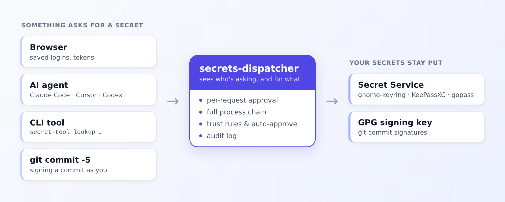

# Secrets Dispatcher

[](https://github.com/nikicat/secrets-dispatcher/actions/workflows/check.yml)
[](https://github.com/nikicat/secrets-dispatcher/releases/latest)
[](LICENSE)

## What it is

**Secrets Dispatcher** is a per-operation approval gate and audit log for the **Linux keyring and git commit signing** — a drop-in [Secret Service](https://specifications.freedesktop.org/secret-service/) proxy that sits in front of the keyring you already have (gnome-keyring, [gopass-secret-service](https://github.com/nikicat/gopass-secret-service), KeePassXC…). Same secrets, same data, and **[reversible in one command](#setup)**.



## What it does

When something reads a secret, you see *what* it touched and the full process chain (`claude-code → node → secret-tool`), and you approve, deny, or auto-allow — the tools you trust fade into rules, everything else has to ask. Every access is logged, and the same gate covers what gets committed and signed as you (`git commit -S`).

## Why it's needed

**Your AI coding agent runs as you — so it can read every secret in your keyring, silently.** Claude Code, Cursor, Codex, any script you launch call the Linux Secret Service and read any unlocked credential with no prompt and no log. Usually it isn't malice — just an agent taking a wrong path to a task — but you never see it happen. Underneath that:

- **The keyring has no per-app access control.** Once it's unlocked, any process running as you can read any secret over the Secret Service D-Bus API — no prompt, no audit trail, no way to know which process accessed what.
- **`git commit -S` signs blindly.** GPG signs whatever it's handed, with no human-visible context — so an agent or CI step can produce a commit signed by *you* with content you never reviewed.

> **Honest scope.** This is visibility and control — *not* a sandbox or a privilege
> boundary. It runs as your user, and it gates the **keyring** and **GPG signing**, not
> `.env` files or arbitrary disk reads. A smoke detector, not a vault door: pair it with a
> sandbox if you need to *contain* an agent; use this to *see and decide* when the agents,
> apps, and scripts you run natively touch your secrets or signing key. [More on the security
> model →](SECURITY.md)

> **Applies to:** **Linux desktops** with a Secret Service keyring on the session bus.
> The reversible one-command setup is verified on **GNOME** (gnome-keyring) and
> **[gopass-secret-service](https://github.com/nikicat/gopass-secret-service)**; KDE/KWallet,
> KeePassXC, and other desktops aren't verified yet and may need manual setup. **Not macOS
> or Windows** — those use different keyring APIs (gopass the CLI runs there, but the
> Secret Service this gates does not). [Details →](docs/COMPATIBILITY.md)

## Setup

You need Linux with a running Secret Service keyring and/or GPG for signing — the commands auto-detect your provider (see [Applies to](#) above for which desktops are verified). First, get the binary:

```bash
# Prebuilt static binary (amd64; arm64 also on the releases page)
curl -Lo ~/.local/bin/secrets-dispatcher \
  https://github.com/nikicat/secrets-dispatcher/releases/latest/download/secrets-dispatcher-linux-amd64
chmod +x ~/.local/bin/secrets-dispatcher
```

<details>
<summary>Other install methods — <code>go install</code>, from source</summary>

```bash
# With Go (web UI included — the compiled frontend is committed)
go install github.com/nikicat/secrets-dispatcher@latest

# From source (needs Go + npm for the embedded web UI)
git clone https://github.com/nikicat/secrets-dispatcher.git
cd secrets-dispatcher && make build && make install   # → ~/.local/bin
```

</details>

### Temporary — try it, fully reversible

One command puts the dispatcher in front of your keyring (same data, demoted to a private backend) and prints a web UI address. **Ctrl-C restores everything exactly** — your config is never touched.

```bash
secrets-dispatcher try
# then, in another terminal, make something ask for a secret:
secret-tool store --label=demo service demo
secret-tool lookup service demo        # → an approval prompt appears
```

`secrets-dispatcher try --dry-run` shows the exact file/unit changes first, and `secrets-dispatcher service status` confirms the takeover state any time.

<details>
<summary>Screencast — the reversible trial</summary>

[](https://nikicat.github.io/secrets-dispatcher-ci-media/latest/trial-noble.mp4)

*(click for the full video)*

</details>

### Permanent — run it as a service

Install the systemd user service and put the dispatcher in front of your keyring on every login. `service uninstall` restores stock behavior exactly.

```bash
secrets-dispatcher service install   # installs, starts, and takes over your keyring
secrets-dispatcher service status    # confirm it's in front of your keyring
```

Now every secret access — and every signed commit — goes through approval, via a desktop notification, the CLI (`secrets-dispatcher list`), or the web UI (`secrets-dispatcher login`).

<details>
<summary>Screencasts — install &amp; uninstall</summary>

**Install** (permanent, across a re-login):

[](https://nikicat.github.io/secrets-dispatcher-ci-media/latest/install-noble.mp4)

**Uninstall** (back to stock):

[](https://nikicat.github.io/secrets-dispatcher-ci-media/latest/uninstall-noble.mp4)

</details>

### Gate git commit signing

Route git's signing through the dispatcher, then **turn signing on globally** — that's what makes *every* commit (including the ones your agents make without `-S`) pause for your review before the key is used:

```bash
secrets-dispatcher gpg-sign setup           # point git's gpg.program at the dispatcher
git config --global commit.gpgsign true      # sign — and therefore gate — every commit
```

Now any `git commit` shows you the repo, message, and changed files and waits for approve/deny before GPG signs. Without global signing, only an explicit `git commit -S` is gated — an agent that just runs `git commit` slips through.

<!-- TODO: record a commit-signing screencast (the trial/install/uninstall ones exist in the ci-media sidecar; signing doesn't yet). -->

## Approving requests

When a request isn't already covered by a rule, you see the full picture — what's asking (the whole process chain), for which secret — and decide:


- **Web UI** — real-time dashboard at `http://127.0.0.1:8484` (`secrets-dispatcher login`)
- **Desktop notifications** — inline Approve / Deny buttons
- **CLI** — `secrets-dispatcher list` · `approve <id>` · `deny <id>`

All three stay in sync in real time.

## Keep secrets out of `.env`

The most common way an agent grabs a credential is reading a plaintext `.env` off
disk — which no keyring gate can see. The fix is to not keep the secret in the file
at all: fetch it from the keyring at runtime with [direnv](https://direnv.net/), so
the value only ever lives in the shell's memory (never on disk) and every fetch goes
through secrets-dispatcher:

```bash
# .envrc — the secret is fetched from the keyring, never written to the file
export API_KEY=$(secret-tool lookup url https://alchemy.com xdg:schema io.github.nikicat.ApiKey)
export SCAN_API_KEY=$(gopass-secret get api-key etherscan.io)   # with gopass-secret-service
```

Now entering the project fetches the secret through the Secret Service — so the first
lookup prompts for approval and every lookup is logged, instead of a plaintext secret
sitting on disk for anything to read. Auto-approve the tools you trust so it stays
quiet. (Once exported, the value is a normal env var in that shell — this removes the
on-disk copy and gates/audits the fetch; it isn't a boundary against a process already
running in the same shell.)

## Configuration

Config lives at `~/.config/secrets-dispatcher/config.yaml`:

```yaml
listen: "127.0.0.1:8484"           # web UI address
serve:
  timeout: 5m                      # approval request timeout
  approval_window: 2s              # batch concurrent requests into one prompt
  notifications: true              # desktop notifications
  ignore_chrome_dummy_secret: true # suppress Chrome's probe
  rules: []                        # trust rules — see docs/TRUST-RULES.md
  trusted_signers: []              # auto-approve GPG signing from these tools
```

**Trust rules** auto-approve known-safe patterns so the dispatcher stays quiet. The easiest way to add or adjust one is the bundled **`secrets-rule` agent skill**: with [Claude Code](https://claude.com/claude-code), hand it a request ID from `secrets-dispatcher list` — `/secrets-rule b260def` — and it reads that request's full context (process chain, `exe`, attributes) to compose an accurate rule; or just say *"always allow Firefox"*. Either way it picks a spoof-proof `exe` match, writes the rule, and offers to restart. See **[docs/TRUST-RULES.md](docs/TRUST-RULES.md)** for the format and how to install the skill.

## Learn more

- **[Architecture](docs/ARCHITECTURE.md)** — how a request is decided, process-chain detection, audit log
- **[Trust rules](docs/TRUST-RULES.md)** — rule format, spoof-proofing, and the `secrets-rule` agent skill
- **[Remote secret access over SSH](docs/REMOTE-PROXY.md)** — use laptop secrets from a server without forwarding gpg-agent
- **[Compatibility & status](docs/COMPATIBILITY.md)** — tested environments, supported backends/clients, feature status
- **[Security model](SECURITY.md)** · **[Target audience & personas](docs/TARGET-AUDIENCE.md)** · **[Contributing & development](CONTRIBUTING.md)**

## License

MIT — see [LICENSE](LICENSE).
