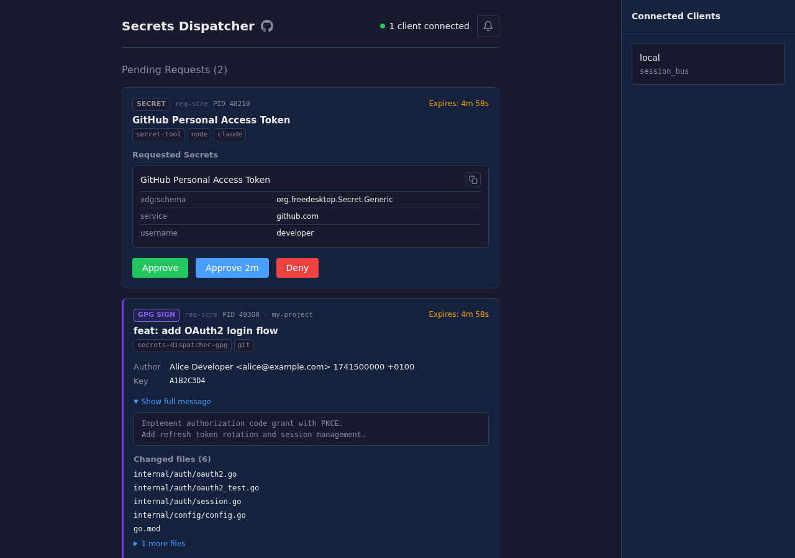

# secrets-dispatcher

[](https://github.com/nikicat/secrets-dispatcher/actions/workflows/check.yml)
[](LICENSE)

Per-operation approval and audit logging for secret access and git commit signing on Linux.

Any process running as your user can silently read your keyring, and `git commit -S` signs whatever GPG is given with no human review. secrets-dispatcher sits between requestors and your secrets/keys, showing you exactly what's being accessed and by whom — and letting you approve, deny, or auto-authorize.

```
┌─────────────┐ ┌─────────────┐ ┌─────────────┐ ┌─────────────┐
│  Browser    │ │  AI Agent   │ │  CLI tool   │ │  git sign   │
│  (Firefox)  │ │(Claude Code)│ │(secret-tool)│ │ (git -S)    │
└──────┬──────┘ └──────┬──────┘ └──────┬──────┘ └──────┬──────┘
       │               │               │               │
       └───────────────┴───────┬───────┴───────────────┘
                               │
                ┌──────────────┴───────────────┐
                │     secrets-dispatcher       │
                │                              │
                │  • per-request approval      │
                │  • process chain detection   │
                │  • trust rules engine        │
                │  • audit logging             │
                └──────┬───────────────┬───────┘
                       │               │
              ┌────────┴────┐   ┌──────┴──────┐
              │Secret Service│   │    GPG      │
              │(gopass, GNOME│   │  (signing)  │
              │ keyring, etc)│   │             │
              └─────────────┘   └─────────────┘
```

## Why

**Local apps access secrets silently.** Any process running as your user can call the Secret Service D-Bus API and read any unlocked secret — browsers, Electron apps, CLI tools, and AI coding agents (Claude Code, Codex, Cursor). There's no audit trail and no per-access approval.

**Git signing is blind.** `git commit -S` invokes GPG with no human-visible context. When AI agents or CI pipelines make commits, arbitrary content gets signed without review.

**gpg-agent forwarding is all-or-nothing.** Forwarding a GPG agent over SSH gives the remote machine blanket access to decrypt *any* secret. No per-secret control.

secrets-dispatcher adds a controlled gateway with:
- **Full process chain visibility** — not just "dbus-daemon asked" but `claude-code → node → secret-tool`
- **Per-operation approval** via web UI, desktop notifications, or CLI
- **Trust rules** — auto-approve known-safe patterns, prompt for everything else
- **Audit logging** — JSON log of every access attempt with process info and decision

## Quick Start

**Prerequisites:** A Secret Service provider (gnome-keyring, [gopass-secret-service](https://github.com/nikicat/gopass-secret-service), KeePassXC) and/or GPG configured.

### Build & Install

```bash
git clone https://github.com/nikicat/secrets-dispatcher.git
cd secrets-dispatcher
make build && make install   # installs to ~/.local/bin
```

### Secret Access Control (local)

```bash
# Start the daemon
secrets-dispatcher serve &

# Or install as a systemd user service (auto-start on login)
secrets-dispatcher service install --start

# Open the web UI
secrets-dispatcher login

# Now any secret access triggers an approval prompt
secret-tool lookup service smtp   # → you'll see a notification
```

### Git Commit Signing

```bash
# One-time setup
secrets-dispatcher gpg-sign setup
git config --global commit.gpgsign true

# Now every signed commit requires approval
git commit -S -m "my signed commit"
# → desktop notification with repo, message, changed files
# → approve or deny before GPG signs
```

## Web UI



## Approval Interfaces

Approve or deny requests through any of:

- **Web UI** — real-time dashboard at `http://127.0.0.1:8484` (open with `secrets-dispatcher login`)
- **Desktop notifications** — inline Approve/Deny action buttons
- **CLI** — `secrets-dispatcher list`, `secrets-dispatcher approve <id>`, `secrets-dispatcher deny <id>`

All three update in real-time — approve via notification and the web UI reflects it instantly.

## Trust Rules

Auto-approve known-safe patterns instead of prompting for every request. Add to `~/.config/secrets-dispatcher/config.yaml`:

```yaml
serve:
  rules:
    # Auto-approve Firefox accessing any secret
    - name: firefox
      action: approve
      process:
        exe: "/usr/lib/firefox/firefox"

    # Auto-approve tools running from your project directory
    - name: my-project
      action: approve
      process:
        cwd: "/home/me/src/my-project/*"

    # Ignore Chrome's dummy secret probe
    - name: chrome-probe
      action: ignore
      request_types: [write]
      process:
        exe: "*chrome*"

    # Auto-approve deploy script accessing deploy secrets
    - name: deploy
      action: approve
      process:
        exe: "/usr/bin/ansible-playbook"
      secret:
        collection: "deploy"

  # Auto-approve GPG signing from specific editors
  trusted_signers:
    - exe_path: /usr/bin/nvim
```

Rules match on process attributes (exe, name, CWD, systemd unit) and secret attributes (collection, label, custom attributes). All patterns support globs. Process matching checks the full process chain, not just the immediate caller.

## Process Chain Detection

When a request comes in, secrets-dispatcher resolves the full process ancestry:

```
Request: GetSecrets → collection/login/github-token
Process chain: claude-code → node → dbus-send
Unit: user@1000.service
```

This means you can write rules that match on the actual originating process, not just the D-Bus sender. Useful for distinguishing "Firefox wants my GitHub token" from "unknown-script → curl → dbus-send wants my GitHub token."

## Secret Service Proxy (Remote Servers)

For accessing secrets on remote servers without forwarding your GPG agent:

```
SERVER (untrusted)                         LAPTOP (trusted)
┌─────────────────────────┐               ┌─────────────────────────────────┐
│                         │               │                                 │
│  App ──► local D-Bus ───┼── SSH ───────►│ secrets-dispatcher              │
│          (libsecret)    │   tunnel      │        │                        │
│                         │               │        ▼                        │
│  No secrets stored here │               │  Local Secret Service           │
│                         │               │  (gopass/gnome-keyring/etc)     │
└─────────────────────────┘               └─────────────────────────────────┘
```

```bash
# SSH with tunnel (laptop)
ssh -L /run/user/1000/secrets-dispatcher/myserver.sock:/run/user/1001/bus user@server

# Start secrets-dispatcher (laptop)
secrets-dispatcher serve --downstream socket:/run/user/1000/secrets-dispatcher/myserver.sock

# Use secrets on server — no changes needed, apps use standard D-Bus
secret-tool lookup service myapp
```

See [docs/REQUIREMENTS.md](docs/REQUIREMENTS.md) for SSH config examples, automation scripts, and server-side setup.

## Audit Logging

All secret access is logged to stderr in structured JSON:

```json
{"time":"2025-03-09T14:22:01Z","level":"INFO","msg":"dbus_call","method":"GetSecrets","items":["collection/login/github-token"],"process_chain":["claude-code","node","dbus-send"],"result":"approved"}
```

## Configuration

Config file: `~/.config/secrets-dispatcher/config.yaml`

```yaml
listen: "127.0.0.1:8484"          # Web UI address
state_dir: "~/.local/state/secrets-dispatcher"

serve:
  log_level: info                  # debug, info, warn, error
  timeout: 5m                      # approval request timeout
  approval_window: 2s              # batch concurrent requests
  notification_delay: 1s           # suppress short-lived requests
  notifications: true              # desktop notifications
  ignore_chrome_dummy_secret: true # suppress Chrome's probe
  rules: []                        # trust rules (see above)
  trusted_signers: []              # GPG signing auto-approve
```

## Compatibility

**Works with** any Secret Service backend:
- [gopass-secret-service](https://github.com/nikicat/gopass-secret-service)
- GNOME Keyring
- KDE Wallet
- KeePassXC

**Works with** any Secret Service client:
- Firefox, Chromium/Chrome, Electron apps
- `secret-tool`, Python `secretstorage`
- AI coding agents (Claude Code, Codex, etc.)
- Any application using libsecret

## Status

| Feature | Status |
|---------|--------|
| Secret Service proxy (local & remote) | Working — proxy, audit logging, trust rules |
| Git GPG commit signing | Working — setup, signing flow, approval UI, auto-approve |
| Web UI | Working — real-time updates, approve/deny, history, trust rules |
| Desktop notifications | Working — inline approve/deny actions |
| CLI | Working — list, approve, deny, history |
| Process chain detection | Working — full ancestry with exe, CWD, systemd unit |
| Trust rules engine | Working — process + secret matching with globs |
| Client pairing (remote) | Planned |
| DH encryption for secrets in transit | Planned |

## Development

```bash
make build          # Build with embedded frontend
make test-go        # Run Go tests
make test-e2e       # Run Playwright E2E tests
make pre-commit     # Lint + format + staticcheck
```

## Documentation

- [Requirements & Roadmap](docs/REQUIREMENTS.md)
- [Target Audience & User Personas](docs/TARGET-AUDIENCE.md)

## License

MIT License
