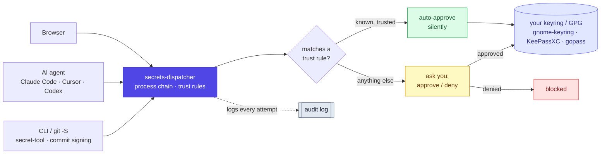

# Architecture

secrets-dispatcher is a proxy that speaks the freedesktop
[Secret Service](https://specifications.freedesktop.org/secret-service/) protocol
on both sides. It registers as the keyring so applications talk to it unchanged,
and behind it sits your real backend (gnome-keyring, KeePassXC, gopass…). The
same approval pipeline also gates `git commit -S` GPG signing.

## How a request is decided

Every secret access — and every signing request — passes through one decision:
if the caller (matched on its full process chain) hits a trust rule, it's
auto-approved silently; otherwise you're asked. Either way it's logged.



The intent is that after the first-week setup — auto-approve rules for the tools
you trust — the dispatcher goes quiet, prompting only for the unknown.

## Process chain detection

When a request arrives, secrets-dispatcher resolves the **full process
ancestry** of the caller, not just the immediate D-Bus sender:

```
Request: GetSecrets → collection/login/github-token
Process chain: claude-code → node → dbus-send
Unit: user@1000.service
```

That's what lets a rule match on the process that actually initiated the
request — distinguishing "Firefox wants my GitHub token" from
"unknown-script → curl → dbus-send wants my GitHub token." Trust rules match
anywhere in this chain; see [TRUST-RULES.md](TRUST-RULES.md) for the rule syntax
and which identifiers can and can't be spoofed.

## Audit logging

Every access attempt — approved, denied, or auto-ruled — is written to stderr as
structured JSON (captured by systemd-journald when run as the user service):

```json
{"time":"2025-03-09T14:22:01Z","level":"INFO","msg":"dbus_call","method":"GetSecrets","items":["collection/login/github-token"],"process_chain":["claude-code","node","dbus-send"],"result":"approved"}
```

## Scope

secrets-dispatcher runs as your user and adds **visibility and control**, not a
privilege boundary — it gates the keyring and GPG signing, not `.env` files or
arbitrary disk reads. See [SECURITY.md](../SECURITY.md) for the threat model.

## Diagram source

The README's architecture diagram is generated from
[`diagram/architecture.html`](diagram/architecture.html); re-render with:

```bash
chromium --headless=new --force-device-scale-factor=2 \
  --screenshot=docs/diagram/architecture.png --window-size=1000,400 \
  docs/diagram/architecture.html
```
